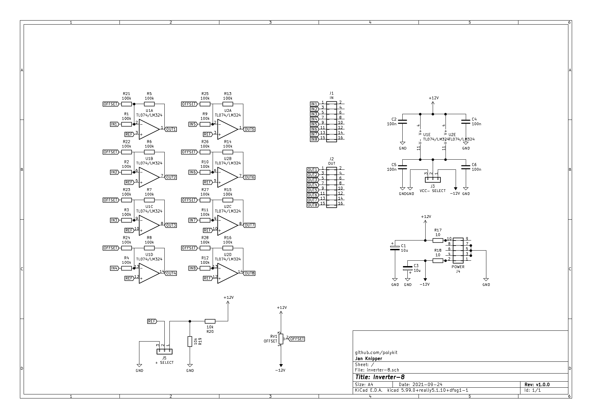

# 8 channel inverter module

This repository contains schematics and PCB layout for an 8 channel inverter with offset control. I use this module to have positive frequency control of the [Polykit VCF-3350-8](https://github.com/polykit/vcf-3350-8).

